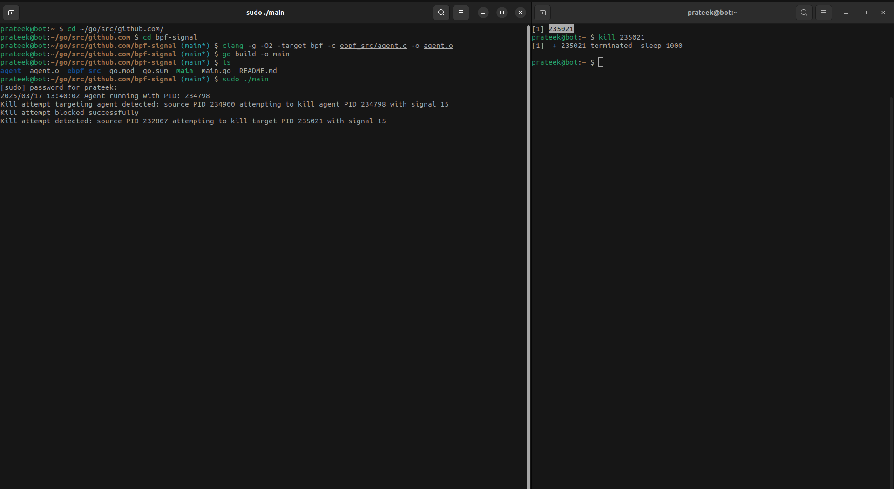

#### Generate vmlinux.h

run `bpftool btf dump file /sys/kernel/btf/vmlinux format c > vmlinux.h` in `ebpf_src` dir.

#### Generate object file

execute `clang -g -O2 -target bpf -c ebpf_src/agent.c -o agent.o`

#### Generate binary

execute `go build -o main`

#### Run agent

execute `sudo ./main`

#### Note

We are not tracing if signal sent is not a kill signal. 

Kill signals that we are tracing (we can add more if needed):

1. `SIGKILL`	9	Immediate, uncatchable termination.

2. `SIGTERM`	15	Graceful termination request.

3. `SIGQUIT`	3	Terminates and produces a core dump.

4. `SIGABRT`	6	Abort signal, typically from abort().

5. `SIGHUP`	    1	Can be used to terminate or reload daemons.

6. `SIGINT`	    2	Sent by Ctrl+C to terminate foreground processes.

7. `SIGSTOP`	19	Immediately stops a process (uncatchable).

8. `SIGTSTP`	20	Stops a process (can be resumed, sent via Ctrl+Z).

9. `SIGTTIN`	21	Stops a background process trying to read input.

10. `SIGTTOU`	22	Stops a background process trying to write output.

#### Demo Screenshot

  

